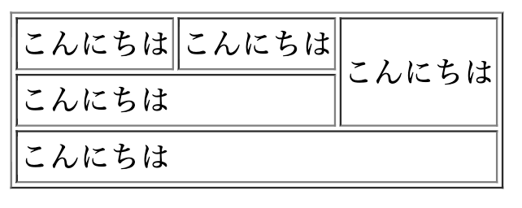
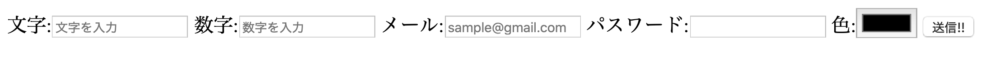

# homework2 
## table
HTMLのtableタグを用いて、下のような表を作りましょう。

## form
HTMLのformやinputを使って、下のような入力フォームを作りましょう!

また、下のように数字しか入力できないフォームやPassword専用のフォームにしてください

余力があれば下のように文字や数字をクリックした時に対応した入力フォームにフォーカスするようにしましょう!

## centerBox
下の画像のように四角形が常に画面の中央に来るようにしてください

